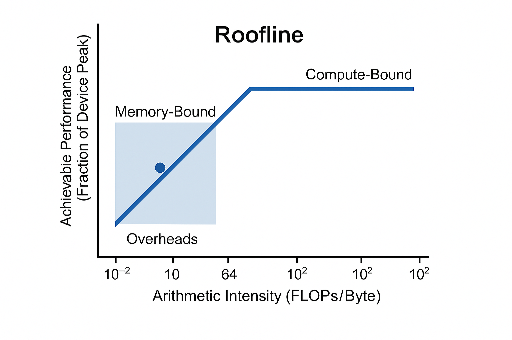

GPUs and custom AI hardware are the engines driving progress in AI research and applications. But raw hardware alone doesn’t explain why some teams ship reliable systems at scale while others struggle with bottlenecks and cost explosions. The difference comes down to how you think about optimization.

A useful way to frame it is as **three nested loops** wrapped around every model. Each loop sits at a different layer of abstraction, and each has its own gauges, and levers. The innermost loop is about the raw efficiency of a single device: is the GPU actually doing useful math, or is it starved by memory bandwidth or kernel overhead? The next loop out is the training loop: how do we scale beyond one GPU and make hundreds or thousands of them behave like a single machine? And finally, there is the product loop: once the model is trained, can we serve it reliably under real-world traffic, meet our latency and safety SLOs, and do so at a cost per token that won't sink the business? 

What makes this framing powerful is that most "mysterious" performance or reliability problems stop being mysterious once you identify which loop you are really in. If a profiler shows long gaps on the GPU timeline, that is an inner loop problem. If throughput collapses when yous cale from one rack to three, that is the training loop. If P95 latency is spiky even though single-GPU kernels are fast, you are in the product loop. The moment you can name the loop, you know where to look and which tools to bring to bear. 

## The Inner Loop: making a single GPU sing

At the very center of AI infrastructure is the question: **is your GPU doing useful math, or is it wasting cycles?** Every model, no matter how large, eventually boils down to kernels running on a single device. If those kernels are inefficient, no amount of distributed wizardry will save you - because inefficiency just multiplies as you scale. The innermost loop is about runtime and kernel performance: understanding where the cycles are going, and how to keep the accelerator fed with a steady diet of compute. 

The mental model here is the _roofline_. Imagine a chart with two axes: arithmetic intensity (FLOPs per byte of memory moved) and achievable performance as a fraction of the device's peak. Your kernels live somewhere on this curve. If they are stuck in the low-intensity, memory-bound region, HBM-bandwidth - not Tensor Cores - is your bottleneck. If they are compute bound, the question becomes whether you are actually saturating those Tensor Cores. And if they are nowhere near the roofline at all, overheads are eating you alive - kernel launch latency, Python-GIL stalls [^1], or CPU-GPU syncs that keep the device idle. 

**Profiling is your compass:** Tools like Nsight Systems or PyTorch's built-in profilers don't just tell you how long each op takes - they show whether your GPU is mostly waiting on memory, struggling with occupancy, or simply not being kept busy. A typical training run might reveal long gaps between kernels, pointing to launch overhead. Or you might see HBM pegged at 90% while tensor utilization hovers at 20%, a classic sign that you are memory bound. 

This isn't just hypothetical. Microbenchmark studies on Volta and Turing GPUs have shown just how sharp the drop-offs can be. On Volta, for example, the L1 cache hit latency was measured at only 28 cycles, compared to 84 cycles on Pascal - nearly a 3 times improvement, but only if your working set fits. On Turing's T4, researchers found that vectorized 128-bit global memory instructions doubled the throughput of a simple SAXPY kernel compared to NVIDIA's own cuBLAS implementation that used 64-bit loads. The point is that the line between compute- and memory-bound is not theoretical: it shows up directly in latency histograms and throughput counters, and it shifts with every architectural generation. 

When _memory is the problem_, the fix is often algorithmic. Attention kernels are a perfect example. Naive implementations read and write enormouse intermediate matrices, swamping HBM. FlashAttention-style kernels, by contrast, restructure the computation to minimize memory traffic, moving closer to the compute-bound region of the roofline. Similarly, fusing QKV projections or using block-sparse attention can trade redundant memory ops for denser math. 

When _overhead is the problem_, you need to reduce the number of trips between host and device. Every kernel launch carries a cost, and if your training loop is littered with tiny ops, that cost adds up. The solution is fusion: combining bias, activation, and dropout in a single kernel, or capturing whole decode loops with CUDA Graphs so they run as a single replayable unit. The mantra is **"fewer, fatter kernels."**

### References
1. Zhe Jia, Marco Maggioni, Benjamin Staiger, Daniele P. Scarpazza. Dissecting the NVIDIA Volta GPU Architecture via Microbenchmarking. Technical Report, Citadel Enterprise Americas, LLC. arXiv:1804.06826 [cs.DC], 2018. [Online]. Available: https://arxiv.org/abs/1804.06826
2. Zhe Jia, Marco Maggioni, Jeffrey Smith, Daniele P. Scarpazza. Dissecting the NVIDIA Turing T4 GPU via Microbenchmarking. Technical Report, Citadel Enterprise Americas, LLC. arXiv:1903.07486 [cs.DC], 2019. [Online]. Available: https://arxiv.org/abs/1903.07486
3. Cristiano Malossi, et al. Characterizing the Performance and Scalability of Graphcore’s IPU Architecture via Microbenchmarking. arXiv:2104.07346 [cs.DC], 2021. [Online]. Available: https://arxiv.org/abs/2104.07346

[^1]: This is a performance bottleneck that occurs in multi-threaded programs when a CPU-intensive thread holds the Global Interpreter Lock (GIL) for an extended period, preventing other threads - including I/O-bound ones - from running. This effectively serializes execution and can cause application-wide delays, leading to unresponsiveness. 